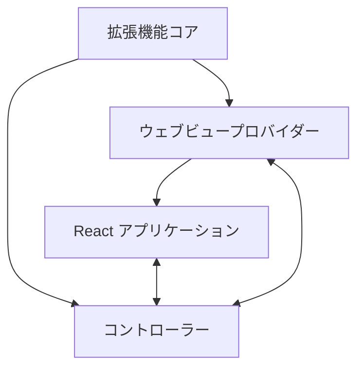
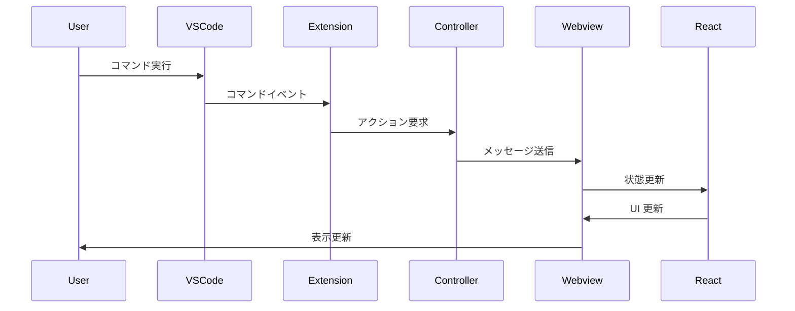

# システムパターン

## アーキテクチャ概要

AIChat VS Code 拡張機能は、以下の主要コンポーネントで構成されています：

1. **拡張機能コア**：VS Code API と対話し、拡張機能のライフサイクルを管理
2. **ウェブビュープロバイダー**：VS Code のウェブビューを管理し、UI を提供
3. **コントローラー**：拡張機能とウェブビュー間の通信を管理
4. **React アプリケーション**：ウェブビュー内で実行される UI コンポーネント

## コンポーネント関係

## 主要設計パターン

### 1. MVC パターン

拡張機能は基本的に MVC（Model-View-Controller）パターンに従っています：

-   **Model**: 共有データ型（ExtensionState, WebviewMessage など）
-   **View**: React コンポーネント（ChatView, SettingsView など）
-   **Controller**: コントローラークラスとメッセージハンドラー

### 2. メッセージングパターン

拡張機能とウェブビュー間の通信は、メッセージングパターンを使用しています：

-   `ExtensionMessage`: 拡張機能からウェブビューへのメッセージ
-   `WebviewMessage`: ウェブビューから拡張機能へのメッセージ

### 3. コンテキストプロバイダーパターン

React アプリケーションでは、コンテキストプロバイダーパターンを使用して状態を管理しています：

-   `ExtensionStateContext`: 拡張機能の状態を管理し、コンポーネント間で共有

### 4. イベント駆動アーキテクチャ

ユーザーインタラクションとシステムイベントは、イベント駆動アーキテクチャで処理されます：

-   コマンド登録（`vscode.commands.registerCommand`）
-   メッセージイベントリスナー（`useEvent("message", handleMessage)`）

## データフロー

## 重要な実装パス

### 拡張機能の起動

1. `extension.ts` の `activate` 関数が呼び出される
2. `WebviewProvider` インスタンスが作成される
3. サイドバーウェブビューが登録される
4. コマンドが登録される

### ウェブビューの初期化

1. `WebviewProvider.resolveWebviewView` が呼び出される
2. ウェブビューの HTML コンテンツが設定される
3. React アプリケーションが初期化される
4. `webviewDidLaunch` メッセージが拡張機能に送信される

### メッセージング

1. 拡張機能は `controller.postMessageToWebview` を使用してメッセージを送信
2. ウェブビューは `vscode.postMessage` を使用してメッセージを送信
3. メッセージハンドラーがメッセージを処理し、適切なアクションを実行

## 設定管理

-   API 設定（`ApiConfiguration`）
-   自動承認設定（`AutoApprovalSettings`）
-   ブラウザ設定（`BrowserSettings`）
-   チャット設定（`ChatSettings`）
-   テレメトリー設定（`TelemetrySetting`）

## 拡張ポイント

-   新しい API プロバイダーの追加
-   追加の設定オプション
-   UI コンポーネントの拡張
-   新しいコマンドの追加
